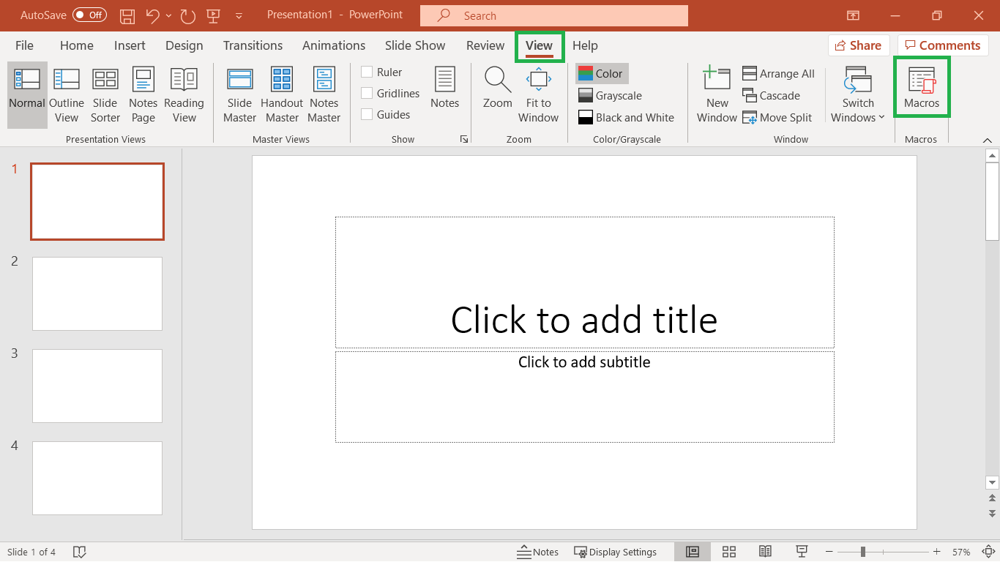
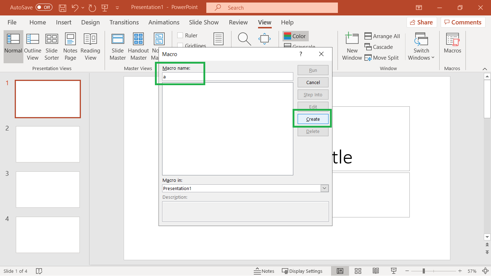
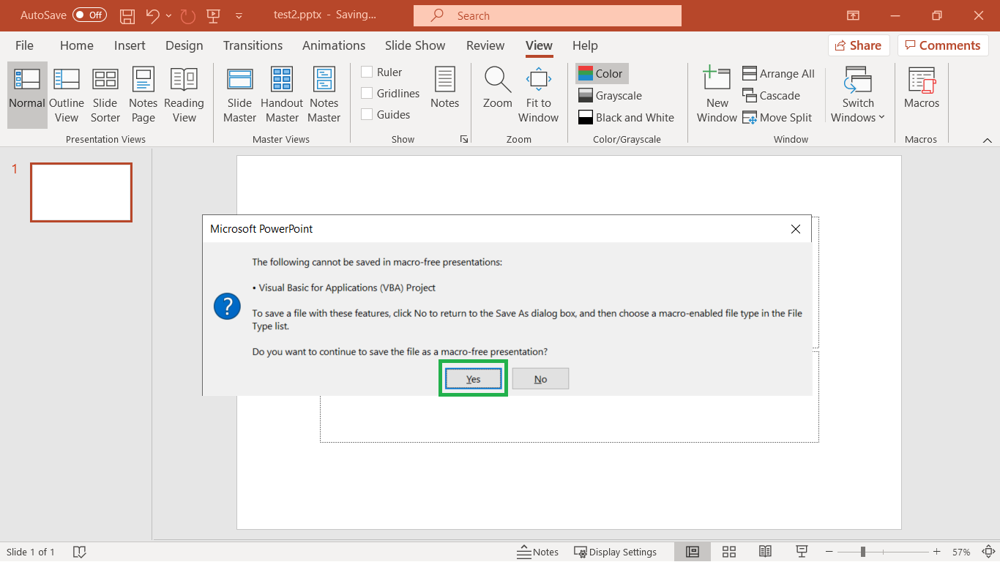

# Shrink your PowerPoint Slides

The macro below deletes all unused layouts in the Slide Master view of a PowerPoint presentation. To use it (screenshots at the bottom) just go to view -> macros -> type something in -> create -> overwrite the macro with the code below -> click run -> close the macro editor -> click save -> say yes to a macro-free presentation dialog. Once you do it a few times, it's fast and people will appreciate sometimes __much__ smaller file sizes.

I put this site up because I was tired of going back to google to find the code snippet which has been out for over a decade...

If you have a really big pptx, you can also unzip it, and look at the ppt/media folder for the culprit large image, etc.

## The Macro Code

    Sub CleanupDesigns()
        Dim I As Integer
        Dim J As Integer
        Dim oPres As Presentation
        Set oPres = ActivePresentation
        On Error Resume Next
        With oPres
            For I = 1 To .Designs.Count
                For J = .Designs(I).SlideMaster.CustomLayouts.Count To 1 Step -1
                    .Designs(I).SlideMaster.CustomLayouts(J).Delete
                Next
            Next I
        End With
    End Sub

## Walkthrough Images

Step 1

Step 2

Step 3

Step 4

Step 5

